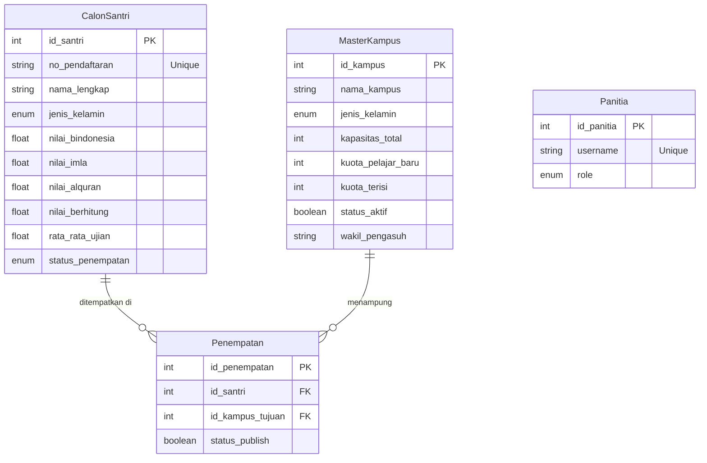

# Entity-Relationship Diagram (ERD)

Diagram ini menggambarkan hubungan antar entitas utama dalam sistem SantriPlacement.

### Penjelasan Entitas:

1.  **CalonSantri**:
    *   Menyimpan data calon santri yang telah lulus ujian.
    *   Setiap santri memiliki nilai dari berbagai mata pelajaran yang digunakan untuk menentukan rata-rata.

2.  **MasterKampus**:
    *   Menyimpan data semua kampus yang tersedia.
    *   Setiap kampus memiliki kuota, kapasitas, dan status aktif.
    *   Kolom `jenis_kelamin` menentukan apakah kampus tersebut untuk "Laki-laki" atau "Perempuan".

3.  **Penempatan**:
    *   Tabel penghubung yang mencatat santri mana ditempatkan di kampus mana.
    *   Ini adalah hasil dari proses algoritma penempatan.

4.  **Panitia**:
    *   Menyimpan data akun pengguna (admin) yang dapat mengakses dasbor.
