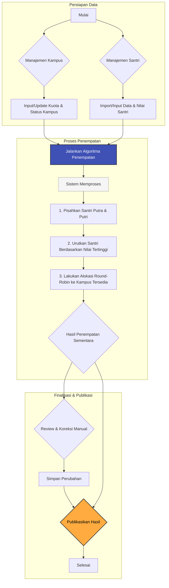

# Flowchart Aplikasi SantriPlacement

Dokumen ini menjelaskan alur kerja utama dari sistem SantriPlacement, mulai dari persiapan data oleh admin hingga pengecekan hasil oleh santri.

## 1. Alur Kerja Admin



**Penjelasan Alur Kerja Admin:**

1.  **Persiapan Data**: Admin memastikan data `MasterKampus` (kuota, status) dan `CalonSantri` (data diri, nilai ujian) sudah lengkap dan valid.
2.  **Proses Penempatan**: Admin menekan tombol "Jalankan Penempatan Otomatis".
3.  **Sistem Memproses**:
    *   Algoritma memisahkan santri berdasarkan jenis kelamin.
    *   Santri diurutkan dari nilai rata-rata tertinggi ke terendah.
    *   Sistem melakukan alokasi ke kampus yang sesuai dengan jenis kelamin dan yang kuotanya masih tersedia.
4.  **Review & Koreksi**: Hasil sementara ditampilkan. Admin dapat meninjau dan melakukan pemindahan manual jika diperlukan.
5.  **Publikasi**: Setelah semua hasil dianggap final, admin menekan tombol "Publish Hasil" agar dapat dilihat oleh santri.

## 2. Alur Pengecekan Santri

```mermaid
flowchart TD
    subgraph "Akses Publik"
        P_A[Santri Mengunjungi Halaman Utama] --> P_B[Input Nomor Pendaftaran];
        P_B --> P_C[Klik Tombol "Cek Hasil"];
        P_C --> P_D{Sistem Mencari Data};
        P_D --> P_E{Hasil Ditemukan?};
        P_E -- Ya --> P_F[Tampilkan Detail Penempatan];
        P_E -- Tidak --> P_G[Tampilkan Pesan "Data Tidak Ditemukan"];
    end
```

**Penjelasan Alur Pengecekan Santri:**

1.  Santri membuka halaman publik aplikasi.
2.  Ia memasukkan nomor pendaftaran yang dimiliki.
3.  Sistem akan mencari data di tabel `Penempatan` yang statusnya sudah `status_publish = true`.
4.  Jika data ditemukan, detail penempatan (nama, kampus tujuan, dll.) akan ditampilkan. Jika tidak, sistem akan memberikan notifikasi bahwa data tidak ditemukan.
